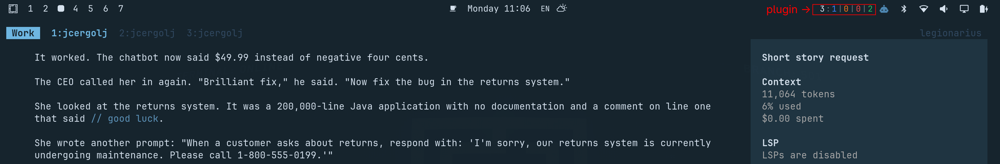

# Praefectus OpenCode

Keep track of all your OpenCode sessions directly from the Omarchy bar.

Praefectus shows which agents are **working**, **waiting for your response**, **waiting for permission**, or **idle** — and lets you jump straight to the relevant terminal or tmux pane.



## Why?

Running several OpenCode sessions at once gets difficult surprisingly quickly.

Which one is still working?
Which agent is waiting for permission?
Which terminal needs your response?

Praefectus gives you a small command center in your Omarchy bar:

```text
5:2|1|1|1
```

Where:

* `5` — total OpenCode sessions
* `2` — working
* `1` — waiting for your response
* `1` — waiting for permission
* `1` — idle

Click any counter to see the matching sessions, then click a session to focus its terminal or tmux pane.

## Features

* Live status of all top-level OpenCode sessions
* Working, response, permission and idle states
* Clickable session lists
* Jump directly to the terminal or tmux pane running a session
* Cycle between sessions using keyboard shortcuts
* Desktop notifications when an agent needs attention or finishes
* Context-window usage when OpenCode exposes token metadata
* Optional colored counters
* Ignores nested OpenCode processes created by subagents
* Does not scrape terminal output or read OpenCode's private storage

## Installation

Install the Omarchy plugin:

```bash
omarchy plugin add https://github.com/jcergolj/praefectus-opencode.git --enable
```

The widget can immediately detect running OpenCode processes and idle sessions.

When the widget is enabled, it automatically installs the bundled OpenCode
status bridge through Omarchy's native process integration. The bridge is
placed at `~/.config/opencode/plugins/praefectus-opencode.js` and is loaded by
new OpenCode sessions.

Restart already-running OpenCode sessions once after enabling the widget.

## Uninstall

Remove the automatically installed OpenCode status bridge:

```bash
rm ~/.config/opencode/plugins/praefectus-opencode.js
```

Remove the Omarchy plugin:

```bash
omarchy plugin remove praefectus.opencode
```

Restart OpenCode after removing the files.

## Keyboard Shortcuts

Praefectus can focus sessions directly from Hyprland.

Add these bindings to `~/.config/hypr/bindings.lua`:

```ini
bind = SUPER ALT, W, exec, ~/.config/omarchy/plugins/praefectus.opencode/bin/opencode-watch --focus-state working
bind = SUPER ALT, R, exec, ~/.config/omarchy/plugins/praefectus.opencode/bin/opencode-watch --focus-state response
bind = SUPER ALT, P, exec, ~/.config/omarchy/plugins/praefectus.opencode/bin/opencode-watch --focus-state permission
bind = SUPER ALT, I, exec, ~/.config/omarchy/plugins/praefectus.opencode/bin/opencode-watch --focus-state idle

bind = SUPER ALT, TAB, exec, ~/.config/omarchy/plugins/praefectus.opencode/bin/opencode-watch --focus-next
bind = SUPER ALT SHIFT, TAB, exec, ~/.config/omarchy/plugins/praefectus.opencode/bin/opencode-watch --focus-previous
```

Then reload Hyprland:

```bash
hyprctl reload
```

### Default shortcuts

| Shortcut                    | Action                                 |
| --------------------------- | -------------------------------------- |
| `SUPER + ALT + W`           | Focus a working session                |
| `SUPER + ALT + R`           | Focus a session waiting for a response |
| `SUPER + ALT + P`           | Focus a session waiting for permission |
| `SUPER + ALT + I`           | Focus an idle session                  |
| `SUPER + ALT + TAB`         | Focus the next session                 |
| `SUPER + ALT + SHIFT + TAB` | Focus the previous session             |

Repeated presses cycle through matching sessions and wrap around.

## Notifications

Praefectus can notify you when an OpenCode session:

* needs your response
* needs permission
* finishes working

Notifications are enabled by default.

Clicking a notification focuses the corresponding session.

The notification timeout can be configured between 8 and 30 seconds from the widget settings.

## How It Works

Praefectus watches top-level `opencode` processes running on the machine.

The bundled OpenCode plugin publishes lightweight per-process status information. Status files are stored under `$XDG_RUNTIME_DIR`, falling back to `~/.cache` when necessary.

Praefectus does **not** scrape terminal output and does **not** access OpenCode's private storage.

Processes are matched using Linux process start ticks, which prevents stale status information from being associated with newly created processes reusing the same PID.

## Why "Praefectus"?

*Praefectus fabrum* was a Roman officer responsible for craftsmen, engineers and other technical workers.

OpenCode agents are today's technical workers.

Praefectus keeps an eye on them and tells you which one needs your attention.

## Tests

Run the watcher tests:

```bash
python3 -m unittest discover -s tests -v
```

Run the OpenCode bridge tests:

```bash
node --test tests/test_opencode_plugin.mjs
```

## License
MIT
