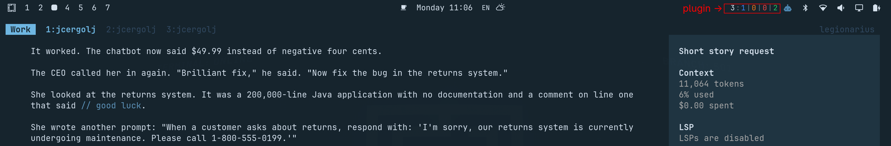

# Praefectus OpenCode

Keep track of all your OpenCode sessions directly from the Omarchy bar.

Praefectus shows which agents are **working**, **waiting for your response**, **waiting for permission**, or **idle** — and lets you jump straight to the relevant terminal or tmux pane.



## Why?

Running several OpenCode sessions at once gets difficult surprisingly quickly, if you aren't constantly focused on the terminal.

Which one is still working?
Which agent is waiting for permission?
Which terminal needs your response?

Praefectus gives you a small command center in your Omarchy bar:

```text
5:2|1|1|1
```

Where:

* `5` — total OpenCode sessions
* `2` — working
* `1` — waiting for your response
* `1` — waiting for permission
* `1` — idle

Click any counter to see the matching sessions, then click a session to focus its
terminal or tmux pane. On V2, this also selects that exact OpenCode session.

Sessions in the same directory get Roman-numeral suffixes in creation order:
`foo bar`, `foo bar II`, `foo bar III`, and so on. Titles stay stable when another
session closes; numbering resets once all sessions in that directory close.

## Features

* Live status of all top-level OpenCode sessions
* Working, response, permission and idle states
* Clickable session lists
* Jump directly to the terminal or tmux pane running a session
* Cycle between sessions using keyboard shortcuts
* Desktop notifications when an agent needs attention or finishes
* Context-window usage when OpenCode exposes token metadata
* Optional colored counters
* Ignores nested OpenCode processes created by subagents
* Does not scrape terminal output or read OpenCode's private storage

## Installation

### OpenCode version compatibility

**Praefectus release numbers are not OpenCode version numbers.** In particular,
Praefectus `v2` is an OpenCode **V1** release, not an OpenCode V2 bridge.

| Praefectus release / revision | Commit | OpenCode compatibility |
| --- | --- | --- |
| [v1](https://github.com/jcergolj/praefectus-opencode/releases/tag/v1) | [`845262e`](https://github.com/jcergolj/praefectus-opencode/commit/845262e) | V1 only |
| [v2](https://github.com/jcergolj/praefectus-opencode/releases/tag/v2) | [`b66db00`](https://github.com/jcergolj/praefectus-opencode/commit/b66db00) | V1 only |
| [v3](https://github.com/jcergolj/praefectus-opencode/releases/tag/v3) | [`385084f`](https://github.com/jcergolj/praefectus-opencode/commit/385084f) | V1 only |
| [v4](https://github.com/jcergolj/praefectus-opencode/releases/tag/v4) — last V1-only release | [`e1660c6`](https://github.com/jcergolj/praefectus-opencode/commit/e1660c6) | V1 only |
| Dual-version compatibility update — **unreleased** | [`4c47776`](https://github.com/jcergolj/praefectus-opencode/commit/4c47776) | V1 **1.18.29+** and V2 full-screen TUI (smoke-tested on **2.0.24**) |

The same bundled source supports both versions; you do not need separate
Praefectus builds. OpenCode selects the V1 server adapter or V2 terminal adapter.
The status-file format, watcher, focus commands, and notification policy are
shared. Installation differs because V2 runs a shared background server and
uses a separate terminal plugin API. Older V1 versions are not supported by
the current object entrypoint.

For OpenCode V2, use a checkout containing `plugin/tui.js` and
`plugin/package.json`; **none of the existing `v1`–`v4` tags includes it**.
V2 support starts at commit `4c47776`; use that commit or a descendant.
For a pinned V1-only checkout, use `git checkout v4` (or the exact commit
`e1660c656aa7b3f8fcf9f7ce4a451f78a1c6c608`) in a clean clone.

### Omarchy widget

Install the Omarchy plugin:

```bash
omarchy plugin add https://github.com/jcergolj/praefectus-opencode.git --enable
```

The widget and OpenCode's status bridge are separate integrations. V1 can detect
terminal processes without the bridge (as idle); its bridge adds live states.
**V2 requires the TUI bridge** to discover individual open sessions. A V2 terminal
without valid bridge data produces a `!` warning in the bar (details in the
session panel), not an invented idle entry.

### OpenCode V2 status bridge

Merge this entry into the `plugins` array in `~/.config/opencode/cli.json`
(`$XDG_CONFIG_HOME/opencode/cli.json` if set), preserving other settings/plugins:

```json
{
  "$schema": "https://opencode.ai/v2/cli.json",
  "plugins": ["/path/to/praefectus-opencode/plugin"]
}
```

Use the absolute path to the bundled **directory**, not `plugin/index.js`.
For a standard Omarchy installation this is
`/home/YOUR_USER/.config/omarchy/plugins/praefectus.opencode/plugin`.
Restart the OpenCode TUI after adding it. No background-service restart is needed.

The V2 bridge runs in each local terminal and reads OpenCode's public CLI data
every 500 ms. Each open top-level tab is counted separately, including idle tabs.
With tabs disabled, it tracks the displayed top-level session. Saved history and
unrelated sessions on the shared server are excluded; empty terminals count as
zero. Subagents are never tracked or aggregated into the parent's status.
Restored busy sessions and their own permissions/response forms are included.
The background service is not counted as another terminal.

The same session open in several terminals counts once, with those terminals
retained as focus alternatives. Identity is scoped to the connected server's
public server-info fingerprint, not to the terminal PID.

Closing a working tab keeps its session visible until it finishes, including
while it awaits permission or a response. Clicking it reopens the exact session.
Closed-tab completion is delivered separately from the counted entries, so its
notification remains clickable after the entry disappears. Reopening is possible
while at least one of its owning TUIs is still running; notifications never attach
to a replacement process that reused an old PID.

V2 live status currently covers the **full-screen TUI**, including
`--standalone` and connections to remote servers. `opencode mini`, headless
`opencode run`, and the browser/desktop UI do not load this TUI adapter.
Each counter entry represents a unique top-level session. Entry clicks,
notification clicks, and keyboard cycling switch to that exact session through
a user-private local Unix socket into the owning TUI. Tabs are focused/reopened
using OpenCode's public tabs API, or its router when tabs are disabled.

### OpenCode V1 status bridge

For OpenCode **1.18.29+**, explicitly link the bundled V1 entrypoint:

```bash
mkdir -p ~/.config/opencode/plugins
ln -s /path/to/praefectus-opencode/plugin/index.js ~/.config/opencode/plugins/praefectus-opencode.js
```

Replace `/path/to/praefectus-opencode` with the local directory containing this
plugin. The link points to the Marketplace plugin's bundled source; removing
the Omarchy plugin removes that source, so OpenCode can no longer load the
bridge. Restart OpenCode sessions after installing the bridge.

When upgrading from OpenCode V1 to V2, add the V2 `cli.json` entry above.
The old file symlink alone does **not** load the V2 terminal adapter; you can
remove it with the command below. Both integrations remain opt-in.

## Uninstall

For the V2 bridge, remove only the Praefectus entry from `cli.json`'s `plugins`
array, leaving other plugins and settings intact.

For the V1 bridge, remove its link:

```bash
rm ~/.config/opencode/plugins/praefectus-opencode.js
```

If you previously used a version that automatically created a symlink, remove
that link with the same command. This does not remove any other OpenCode plugin.

Remove the Omarchy plugin:

```bash
omarchy plugin remove praefectus.opencode
```

Restart OpenCode after removing the bridge. The Omarchy plugin never creates or
removes entries in OpenCode's plugin directory; opt-in and cleanup are explicit
user actions.

## Keyboard Shortcuts

Praefectus can focus sessions directly from Hyprland.

Add these bindings to `~/.config/hypr/bindings.lua`:

```ini
bind = SUPER ALT, W, exec, ~/.config/omarchy/plugins/praefectus.opencode/bin/opencode-watch --focus-state working
bind = SUPER ALT, R, exec, ~/.config/omarchy/plugins/praefectus.opencode/bin/opencode-watch --focus-state response
bind = SUPER ALT, P, exec, ~/.config/omarchy/plugins/praefectus.opencode/bin/opencode-watch --focus-state permission
bind = SUPER ALT, I, exec, ~/.config/omarchy/plugins/praefectus.opencode/bin/opencode-watch --focus-state idle

bind = SUPER ALT, TAB, exec, ~/.config/omarchy/plugins/praefectus.opencode/bin/opencode-watch --focus-next
bind = SUPER ALT SHIFT, TAB, exec, ~/.config/omarchy/plugins/praefectus.opencode/bin/opencode-watch --focus-previous
```

Then reload Hyprland:

```bash
hyprctl reload
```

### Default shortcuts

| Shortcut                    | Action                                 |
| --------------------------- | -------------------------------------- |
| `SUPER + ALT + W`           | Focus a working session                |
| `SUPER + ALT + R`           | Focus a session waiting for a response |
| `SUPER + ALT + P`           | Focus a session waiting for permission |
| `SUPER + ALT + I`           | Focus an idle session                  |
| `SUPER + ALT + TAB`         | Focus the next session                 |
| `SUPER + ALT + SHIFT + TAB` | Focus the previous session             |

Repeated presses cycle through matching sessions and wrap around.

## Notifications

Praefectus can notify you when an OpenCode session:

* needs your response
* needs permission
* finishes working

Notifications are enabled by default.

The first valid watcher snapshot establishes a silent baseline. Repeated states
do not notify again. While notifications are disabled, snapshots still advance
transition memory, so re-enabling them does not replay old changes. Sessions
that disappear are removed from that memory.

On V2, each top-level session notifies independently: another session working
in the same terminal cannot suppress its completion or attention notification.
Subagent events never affect parent status, counters, or notifications. Duplicate
terminal views of the same session do not produce duplicate notifications.

On V1, a process finishes only after all of its busy sessions become idle.
When one V1 OpenCode process hosts multiple sessions, outstanding requests take
precedence over busy or idle events from any session. Permission requests take
precedence over response requests; within each kind, the oldest outstanding
request supplies the displayed session and preview. Updating a request keeps its
place in that order. Answering it reveals the next outstanding request, or the
aggregate activity state if none remain. Replies that resume work count as busy
until that session becomes idle, even if no separate busy event arrives.
Rejecting another request does not finish that resumed work.

Clicking a notification focuses the corresponding session.

The notification timeout can be configured between 8 and 30 seconds from the widget settings.

## How It Works

Praefectus watches top-level `opencode` / `opencode.exe` terminal processes
running on the machine, excluding background server/service and API processes.

The bundled bridge publishes lightweight runtime status information: V1
uses process-wide server event hooks, while V2 publishes independent session
records in a per-terminal envelope using public data from the local TUI. V2 never
associates the shared server's PID with a terminal. Status files are stored under
`$XDG_RUNTIME_DIR`, falling back to `~/.cache` when necessary.

Praefectus does **not** scrape terminal output and does **not** access OpenCode's private storage.

Processes are matched using Linux process start ticks, which prevents stale status information from being associated with newly created processes reusing the same PID.
When start ticks are unavailable, matching falls back to the process start timestamp.
Tracking also ties retained state and navigation ownership to that process
lifetime. A V1 replacement starts idle without a valid record; a V2 replacement
shows a bridge warning until valid membership is available. A continuing process
keeps its last observed state during a temporary gap in bridge records (with a
warning on V2).
If a listed process temporarily cannot be inspected, tracking keeps its last
reliable observation until inspection succeeds or the PID disappears.

## Why "Praefectus"?

*Praefectus fabrum* was a Roman officer responsible for craftsmen, engineers and other technical workers.

OpenCode agents are today's technical workers.

Praefectus keeps an eye on them and tells you which one needs your attention.

## Tests

Run the watcher tests:

```bash
python3 -m unittest discover -s tests -v
```

Run the OpenCode bridge and notification tests (Node.js and Python 3 required):

```bash
node --test tests/test_*.mjs
```

Verify the complete suite without running the desktop:

```bash
python3 -m unittest discover -s tests -v && node --test tests/test_*.mjs
```

`NotificationPolicy.js` owns the silent baseline, successive-snapshot memory,
and enablement rules. Each widget creates a policy with `create()` and calls
`accept(jsonLine, notificationsEnabled)`, which returns `{ snapshot, decisions }`.
Each decision contains an `eventType` (`attention` or `finished`), `sessionId`,
and `sourcePid`. V2 decisions additionally carry a self-contained `focusTarget`
with session/server identity and lifetime-checked owning TUIs; snapshots expose
this as `focus_target`. V2 `tracking_id` is server/session scoped, whereas V1
retains its process-lifetime identity even when the latest hosted-session ID
changes. `completed_sessions` carries durable closed-tab completion records
outside the counters, ensuring a slower watcher cannot miss a completion.
Older snapshots without tracking IDs retain their existing identity
fallbacks (PID then session ID for notifications, session ID then PID for cycling).
Malformed JSON, invalid counts or session fields, missing identities, and
duplicate identities throw without advancing the last accepted baseline.

The tests execute the same JavaScript imported by QML. They cover policy traces,
the desktop command builder in `NotificationDelivery.js` (generic text, bounded
timeout, and focus target), and a composed trace through bridge-produced runtime
records, watcher snapshots, and notification decisions, including independent
V2 tabs, deduplication, subagent exclusion, closed-tab completion, and a real
watcher-to-TUI Unix socket navigation test. QML owns rendering and
notification process execution.

## License
MIT
